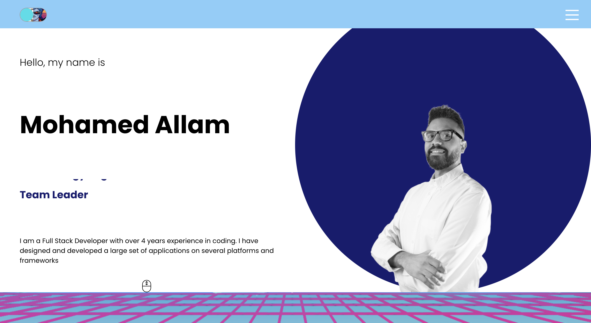
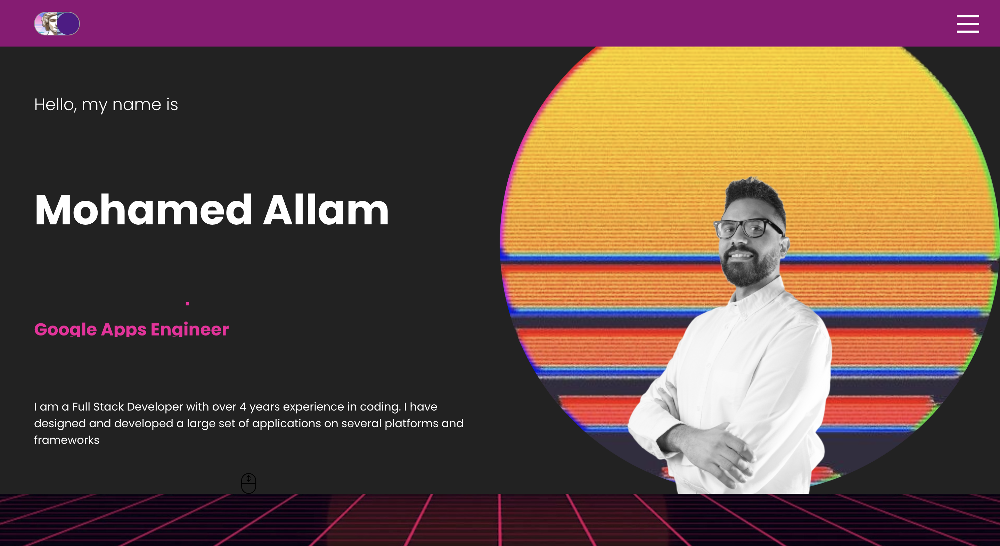

# react-professional-portfolio
My Portfolio made with ReactJS

view it [here](https://mohamedallam13.github.io/react-professional-portfolio/)





## Table of Contents

* [Technologies](#technologies)
* [Installation](#installation)
* [Feature](#feature)
* [Questions](#questions)


## Technologies 

* JavaScript ES6
* HTML5
* CSS3
* Node.js
* ReactJS
* EmailJS

## Installation 

Following are the steps of installation and building

```
npm i
npm run start
```

Deployed with gh-pages via the following command 

```
npm run deploy
```

## Features

* Responsive design
* Outrun / Vapourwave mode
* Full functional Contact form


## Questions 

If you have any more questions, please contact me here:

Github Username: [mohamedallam13](https://mohamedallam13.github.io/react-professional-portfolio/)

Email: [mohamedallam.tu@gmail.com](mailto:mohamedallam.tu@gmail.com)

